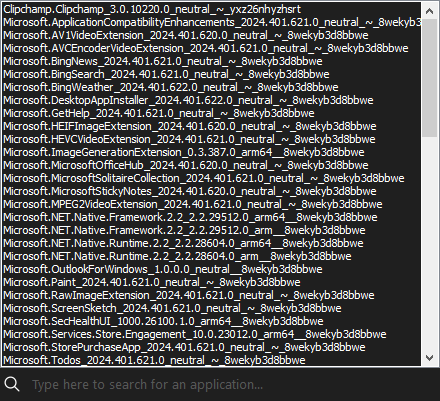

# Information dialogs

    

Like their names suggest, information dialogs let you easily get specific information from a Windows image or installation with powerful and easy to use interfaces.

*The overall action is supported on DISMTools 0.3.1 and newer.*

## Available dialogs

The following dialogs let you get specific information from a Windows image or installation:

| Dialog | Purpose | Remarks |
|:--|:--:|:--|
| [Image information](./img_info.md) | Lets you get the information of any image file | 
-
 |
| [Package information](./pkg_info.md) | Lets you get the information of either installed packages or packages you want to add | <ul><li>Capability information can't be obtained on Windows 8.1/Server 2012 R2 hosts</li></ul>|
| [Feature information](./feat_info.md) | Lets you get the information of all features present in a Windows image | 
-
 |
| [AppX package information](./appxpkg_info.md) | Lets you get the information of installed AppX packages | <ul><li>This action is only supported on Windows 8 and newer systems</li><li>You can't get information of the AppX packages you want to add</li></ul> |
| [Capability information](./cap_info.md) | Lets you get the information of all capabilities present in a Windows image | <ul><li>This action is only supported on Windows 10 and newer</li></ul> |
| [Driver information](./drv_info.md) | Lets you get the information of either installed drivers or the driver packages you want to add | <ul><li>The amount of installed drivers depends on the settings of the background processes</li></ul> |
| [Windows PE information](./winpe_info.md) | Lets you get the information of the target path and the scratch space amount on a Windows PE image | <ul><li>This action is only supported on Windows PE images</li></ul> |

## Saving image information

You can save this information to a file:

    

This action will generate an **image information report**, which you can view at any time. After the process if complete, you will see a preview of the information report after completing the process, which you can save anywhere.

## Searching through this information

Leverate the search functionality in information dialogs to get the results you want more easily. To get started, simply click on the search box text and start typing.

    

The following items support this functionality:

- Installed packages
- Features
- Installed AppX packages (only if the extended AppX getter script is not run)
- Capabilities
- Installed drivers

## Looking up an item online

You can look up a selected item online using your preferred search engine. The following items support this functionality:

- Features
- Capabilities
- Driver INF files (in generated reports)
- Services (in generated reports)

    

You can pick from 5 search engines in Options -> Image operations:

| Search Engine | Available since |
|:--|:--:|
| Google | 0.7.2 |
| Bing | 0.7.2 |
| DuckDuckGo | 0.7.2 |
| Startpage | 0.7.2 |
| Brave Search | 0.7.2 |

Engine modes based on how many artificial intelligence features there are in them were introduced in version 0.7.3 to allow you to have finer control over AI features. Use the drop-down menu in Options -> Image operations to control AI feature tolerance in search engines.

These AI features usually include search summaries, and links to start conversations with a chatbot. If you want more privacy-focused results, configure tolerance settings to only use those that have these features disabled. If you are more permissive when it comes to AI in search engines, you can also configure the tolerance settings accordingly. This gives you complete control, something that I think you should have on every technology.

    

