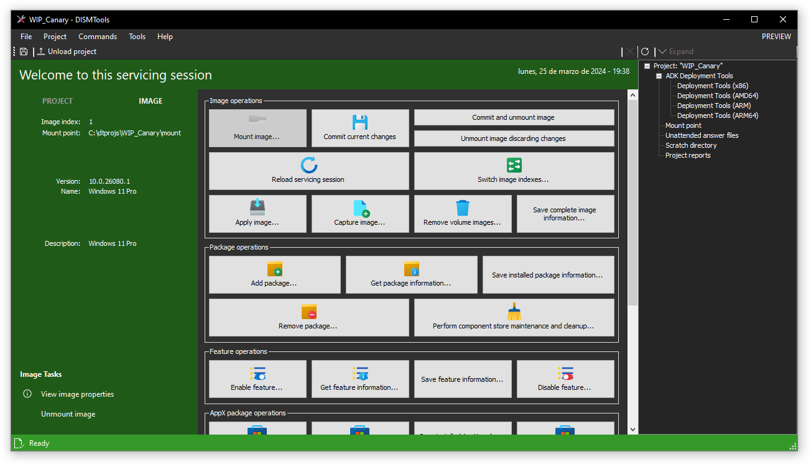

# Welcome to DISMTools

	

Welcome to the DISMTools Help Documentation! With DISMTools you can easily manage your Windows images and installations.

	

To begin browsing the help documentation contents, check out the entries on the side panel. If you want to learn more about some key features in this release, check out [what's new](./whats_new/highlights.md).

If you want to help improve this documentation, learn more [here](https://github.com/CodingWonders/dt_help).